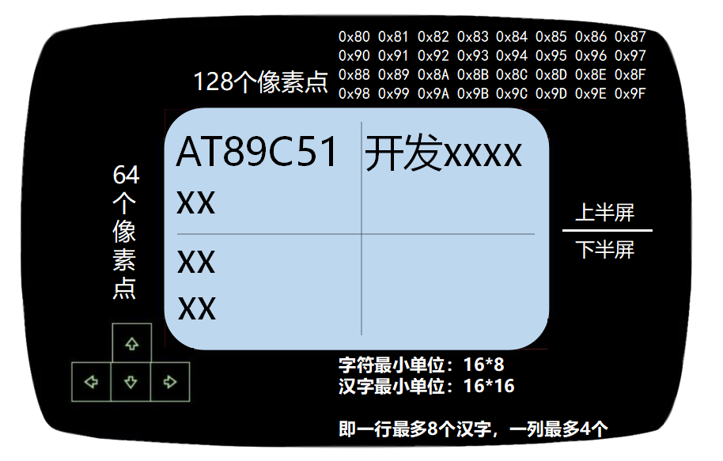
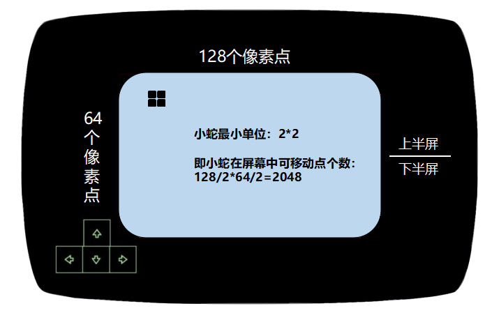
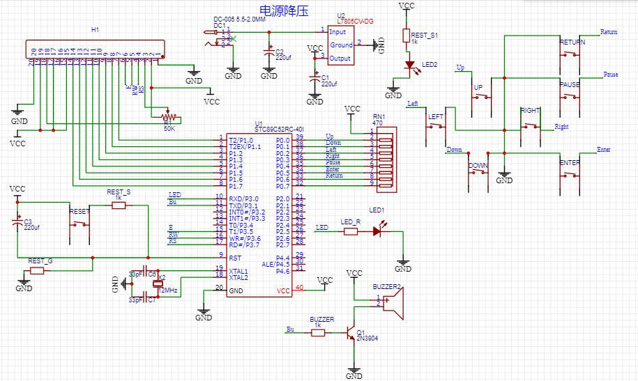

### 项目命令规范

+ 生存期内（临时）变量： 全部小写，'_'连接。       如 snake_towds
+ 静态定义（全局）变量： 全部小写，'_'连接。       如 snake_towds
+ 常量：                 全部大写，'_'连接。       如 #define SYS_EASY 1
+ 宏定义：               全部大写，'_'连接。       如 #define LCD_DATA P1
+ 函数：                 开头字母大写，'_'连接。   如 void LCD_Draw_Clear();
+ 结构体：               开头字母大写，紧挨连接。  如 typedef struct SnakeNode{}SnakeNode;
+ 类型声明：             开头字母大写，'_'连接。   如 typedef unsigned char Status;

### 项目注意事项

+ 本项目基于52单片机
	- 52内部 ROM存储器：8k 、 RAM ：256B
	
+ 存储类型与存储区关系
	- data  --->  可寻址片内ram
	- bdata --->  可位寻址的片内ram
	- idata --->　可寻址片内ram，允许访问全部内部ram
	- pdata --->  分页寻址片外ram (MOVX @R0) (256 BYTE/页)
	- xdata --->  可寻址片外ram (64k 地址范围FFFFH)
	- code  --->  程序存储区 (64k 地址范围),对应MOVC @DPTR
	
+ 本项目基于带中文字库的LCD12864（ST7920）显示屏
    - ⭐具体请参考 ST7920 中文手册，下述总结仅作个人归纳使用
	- 此显示屏采用上下分屏
	- 写入CMD 0x30：表示开启基本指令集
	- 写入CMD 0x34：表示开启扩展指令集
	- 写入CMD 0x01：表示清除DDRAM屏幕
	- 写入CMD 0x36：表示开启GDRAM显示,即显示绘图RAM,不显示字符RAM
	- 都是基于先选择纵坐标，再选择横坐标
	
	- 字符RAM地址空间：
    
    |地位地址|||||||高位地址|
    |:-:|:-:|:-:|:-:|:-:|:-:|:-:|:-:|
	|0x80|0x81|0x82|0x83|0x84|0x85|0x86|0x87|
	|0x90|0x91|0x92|0x93|0x94|0x95|0x96|0x97|
	|0x88|0x89|0x8A|0x8B|0x8C|0x8D|0x8E|0x8F|
	|0x98|0x99|0x9A|0x9B|0x9C|0x9D|0x9E|0x9F|

    

        
    

		
	- P0：8位并行数据线
	- R/S：指令和数据寄存器的选择控制线
	- R/W：读写控制线
	- E：使能线
	
	- GDRAM：对于屏幕上面任意一个点，如果我们想要点亮它，必须先
	读出此点的状态，然后再修改该点，最后送出去。即 读--修改--写

    

        
    

### 项目使用手册

    

> 立创 EDA 示意图