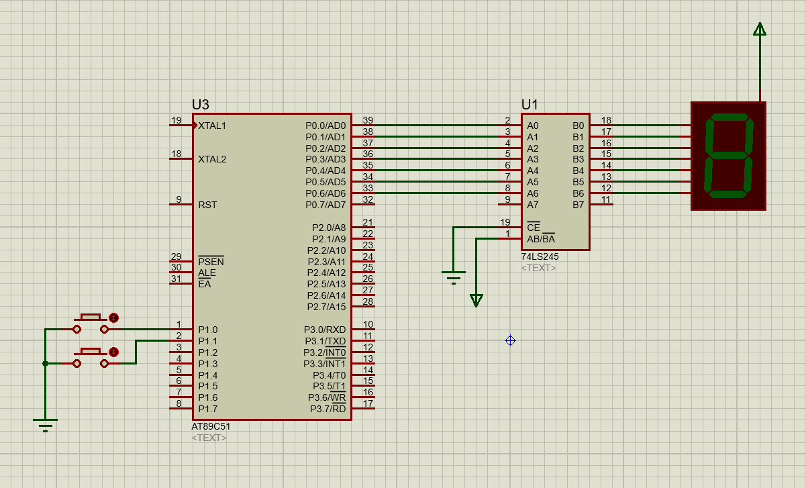
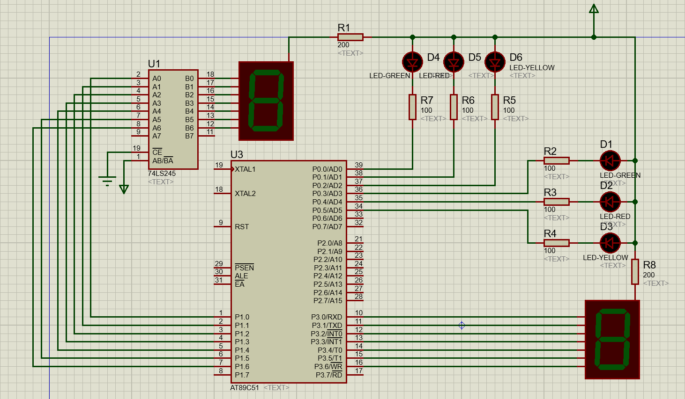
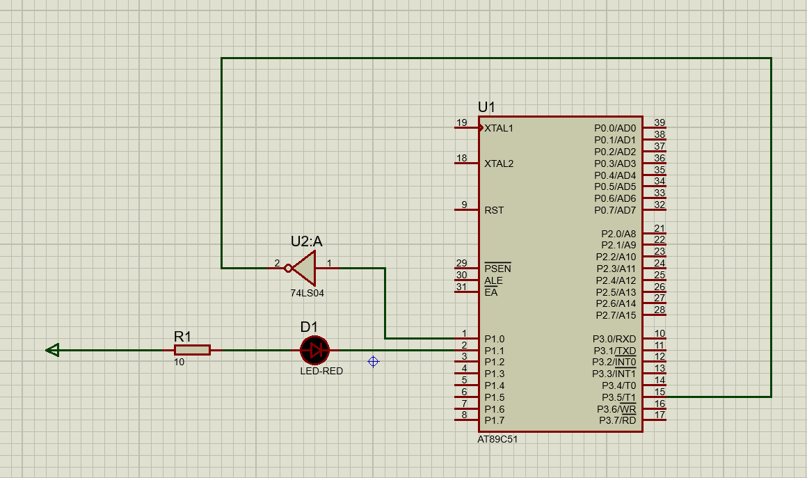
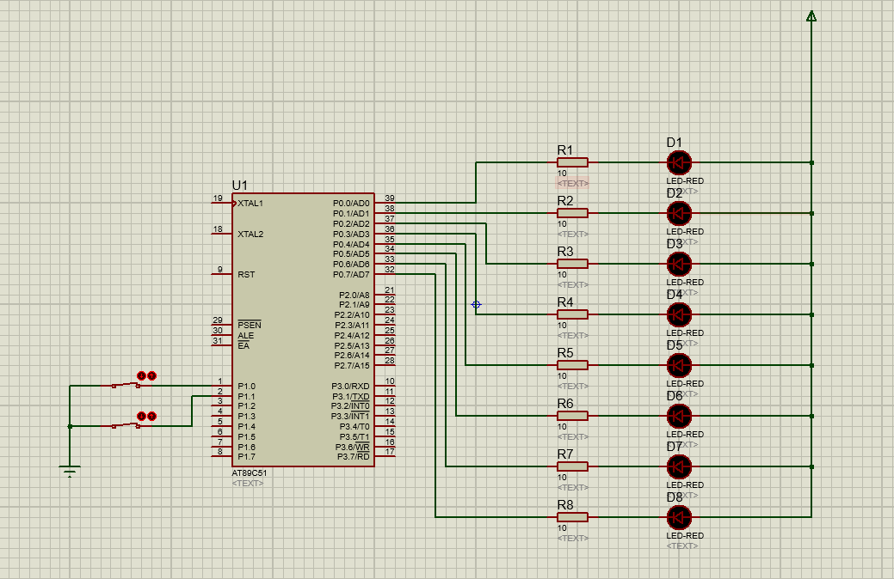
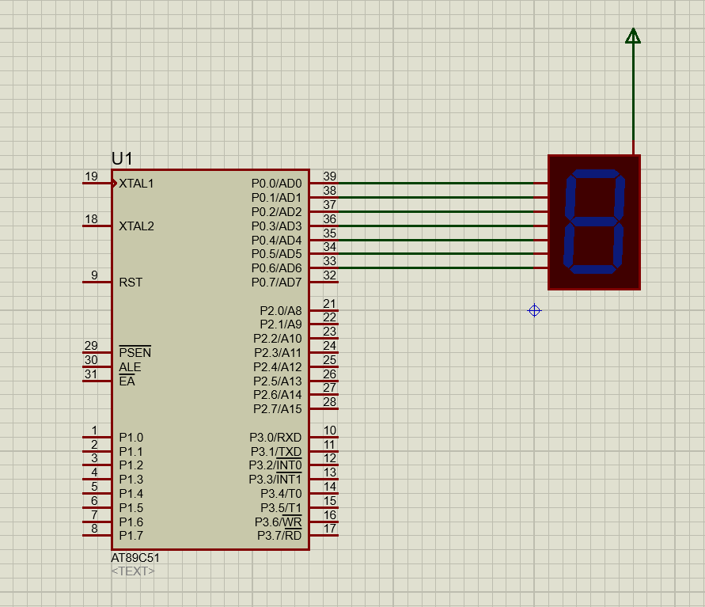
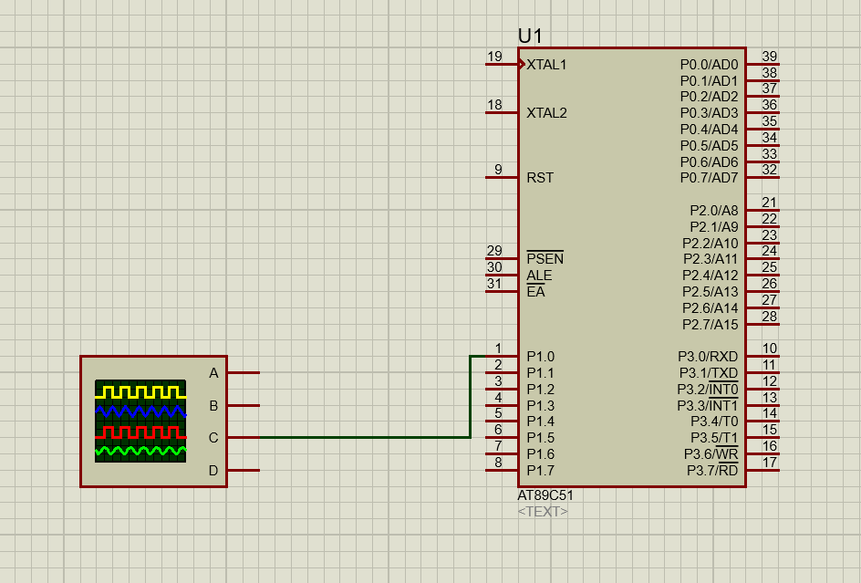
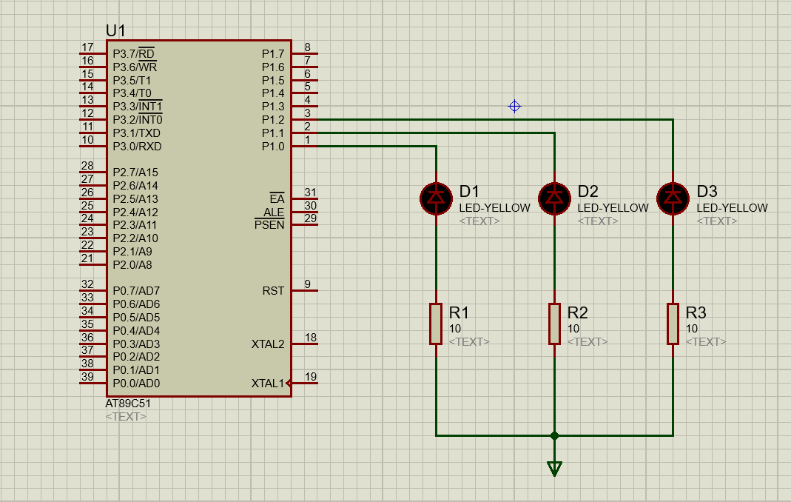
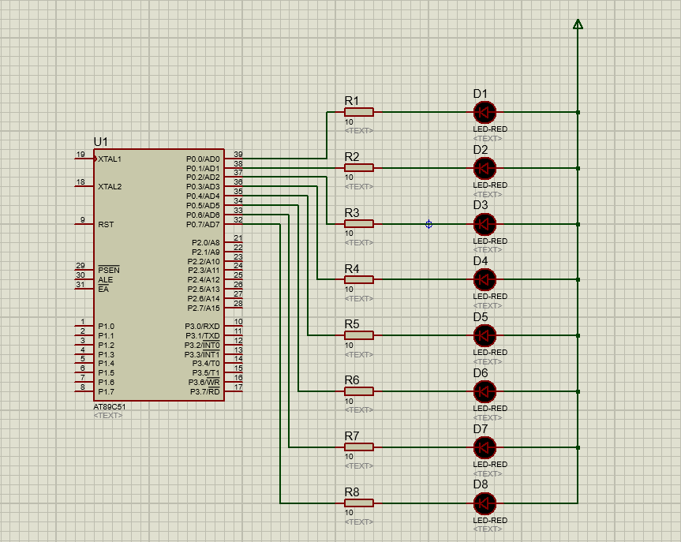
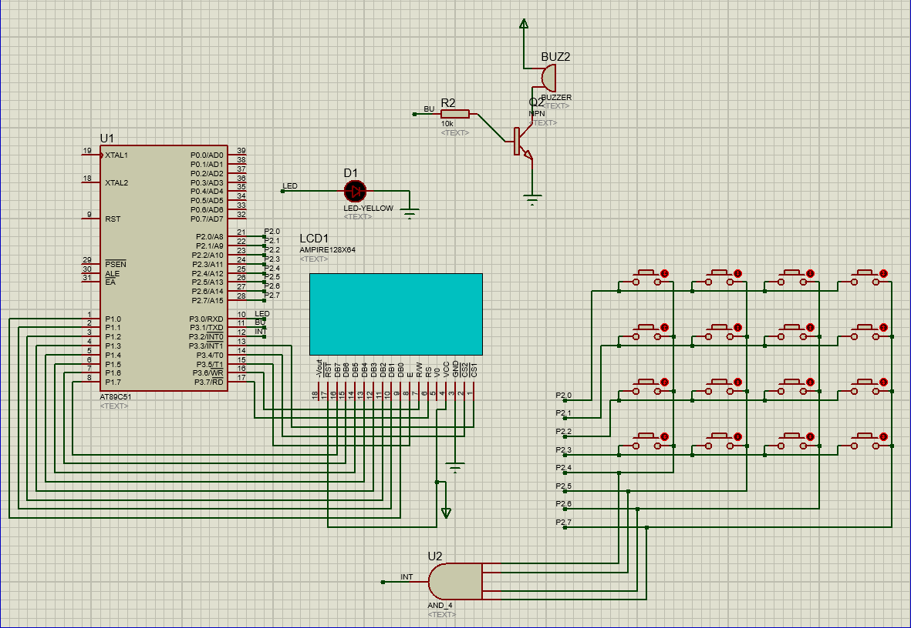

# 单片机
&emsp;&emsp;*《传感器技术》是计算机科学与技术物联网方向和嵌入式方向的一门核心专业课程，是一门理论性和实践性都很强的综合性课程，在计算机科学与技术中具有十分重要的作用。*

    

### 单片机原理与接口技术实验题

> ***注意：** 仅供个人学习使用，不涉及一切商业或其他行为。*

---

#### 1. 数码管数字显示控制程序设计。控制要求：用按键K1和K2分别控制数码管显示数字0~9的顺序，当按下K1键时按从0到9的顺序显示，当按下K2时按从9到0的顺序显示。时间间隔均为1秒。硬件电路如图所示。
  

    
<i>点击展开 Proteus仿真实验图</i>

    
  

  

    <a href="code/pro1/pro1.c">跳转查看C语言源代码➡</a>
  

   --- 

#### 2. 交通控制系统，如下图所示，是交叉路口，要求：绿灯亮9秒后，黄灯闪3秒，后红灯亮9秒，两个数码管分别显视各种灯所剩余时间。
  

    
<i>点击展开 Proteus仿真实验图</i>

    
  

  

    <a href="code/pro2/pro2.c">跳转查看C语言源代码➡</a>
  

   --- 

#### 3. LED灯要求亮2秒钟，灭2秒钟，要求使用定时计数器，要求写主程序与中断程序，fosc = 6MHz
  

    
<i>点击展开 Proteus仿真实验图</i>

    
  

  

    <a href="code/pro3/pro3.c">跳转查看C语言源代码➡</a>
  

   --- 

#### 4. 利用外部中断0，每申请一次中断使P0口连接的发光二极管点亮一个，从低位到高位，同时使P1口连接的发光二极管熄灭一个，从高位到低位。
  

    
<i>点击展开 Proteus仿真实验图</i>

    
  

  

    <a href="code/pro4/pro4.c">跳转查看C语言源代码➡</a>
  

   --- 
  
#### 5. 完成下面电路所示的功能，K1，K2对应两个开关按键。P1口对应发光二极管的状态
|    |P1.0|P1.1|P1.2|P1.3|P1.4|P1.5|P1.6|P1.7|
|:--:|:---|:---|:---|:---|:---|:---|:---|:---|
|K1=0,K2=0|○|○|○|○|○|○|○|○|
|K1=0,K2=1|●|●|●|●|○|○|○|○|
|K1=1,K2=0|●|●|○|○|●|●|○|○|
|K1=1,K2=1|●|●|●|●|●|●|●|●|

  

    
<i>点击展开 Proteus仿真实验图</i>

    
  

  

    <a href="code/pro5/pro5.c">跳转查看C语言源代码➡</a>
  

   --- 
  
#### 6. 在一个数码管上循环显示“H”“E” “L” “L” “O” ,循环的时间为1s。
  

    
<i>点击展开 Proteus仿真实验图</i>

    
  

  

    <a href="code/pro6/pro6.c">跳转查看C语言源代码➡</a>
  

   --- 
  
#### 7. 试采用定时方式2，在P1.0引脚上输出频率为1KHz的方波。
  

    
<i>点击展开 Proteus仿真实验图</i>

    
  

  

    <a href="code/pro7/pro7.c">跳转查看C语言源代码➡</a>
  

   --- 
  
#### 8. 完成下面电路的功能，P1口对应发光二极管的状态，状态1显示的时间为1s，状态2显示的时间为2s，状态3显示的时间为3s，如此循环。
|状态|P1.0|P1.1|P1.2|
|:--:|:---|:---|:---|
|状态1|●|○|●|
|状态2|○|●|●|
|状态3|●|●|○|

  

    
<i>点击展开 Proteus仿真实验图</i>

    
  

  

    <a href="code/pro8/pro8.c">跳转查看C语言源代码➡</a>
  

   --- 
  
#### 9. 彩灯系统，实现8个发光二极管从左到右点亮，每个发光二极管点亮的时间为2s，然后从右到左亮，每个发光二极管点亮的时间为1.5s。

  

    
<i>点击展开 Proteus仿真实验图</i>

    
  

  

    <a href="code/pro9/pro9.c">跳转查看C语言源代码➡</a>
  

   --- 
  
#### 10. 采用51单片机设计门禁系统，4X4键盘用户输入密码，错误蜂鸣器叫一声，正确LED闪烁，12864作为用户界面，初始显示“欢迎光临”，正确与错误时12864有相应的提示。

  

    
<i>点击展开 Proteus仿真实验图</i>

    
  

  

    <a href="code/pro10/pro10.c">跳转查看C语言源代码➡</a>
  

   --- 

  --- 完 ---

