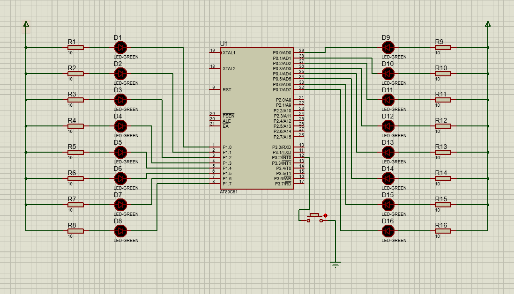

# 单片机原理与接口技术实验题

+ 
+ 
+ 
+ 
+ 
+ 
+ 
+ 
+ 

#### 1. 数码管数字显示控制程序设计。控制要求：用按键K1和K2分别控制数码管显示数字0~9的顺序，当按下K1键时按从0到9的顺序显示，当按下K2时按从9到0的顺序显示。时间间隔均为1秒。硬件电路如图所示。
  

    
  

    

#### 2. 交通控制系统，如下图所示，是交叉路口，要求：绿灯亮9秒后，黄灯闪3秒，后红灯亮9秒，两个数码管分别显视各种灯所剩余时间。
  

    
  

    

#### 3. LED灯要求亮2秒钟，灭2秒钟，要求使用定时计数器，要求写主程序与中断程序，fosc = 6MHz
  

    
  

    

#### 4. 利用外部中断0，每申请一次中断使P0口连接的发光二极管点亮一个，从低位到高位，同时使P1口连接的发光二极管熄灭一个，从高位到低位。
  

    
  

    
  
#### 5. 完成下面电路所示的功能，K1，K2对应两个开关按键。P1口对应发光二极管的状态
|    |P1.0|P1.1|P1.2|P1.3|P1.4|P1.5|P1.6|P1.7|
|:--:|:---|:---|:---|:---|:---|:---|:---|:---|
|K1=0,K2=0|○|○|○|○|○|○|○|○|
|K1=0,K2=1|●|●|●|●|○|○|○|○|
|K1=1,K2=0|●|●|○|○|●|●|○|○|
|K1=1,K2=1|●|●|●|●|●|●|●|●|
